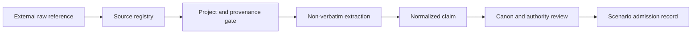

# Verified source intake and canon admission

Yellow Beast turns research references into simulation facts only through a reviewed, reversible data trail:

Raw archives, transcripts, frames, image galleries, and Discord exports stay outside this public repository. Intake records retain a locator, optional filename/hash, provenance classification, review state, and reviewer notes instead.

## Review states

`unreviewed` means a reference is merely present. `triaged` classifies its likely material. `source-verified` verifies the reference and scope. `claim-extracted` records a bounded paraphrase. `canon-reviewed` assigns evidence, canon, and authority classifications. `admitted` permits the claim for an allowed use. `rejected`, `superseded`, and `needs-context` preserve why a record cannot currently drive simulation.

Admission is not monotonic automation: a human reviewer records each transition. The tools produce deterministic validation or proposal output; they never decide canon.

## Gates

First classify project relationship (`confirmed`, `probable`, `unresolved`, `unrelated`) and project category. Then classify provenance: creator authorship, official production, promotional material, in-universe artifact, community work, archive, or unknown.

Finished material can support claims, but creator authorship does not itself establish canon. Production images and promotional material remain separate from finished-screen evidence. A creator Discord archive must retain context and seriousness uncertainty. An in-fiction institutional record demonstrates what that institution asserted, not objective truth.

## Claims and disagreement

Claims retain source refs, a short paraphrase or locator, evidence/canon/authority classifications, confidence, review state, and typed relationships. `supports`, `contradicts`, `qualifies`, `supersedes`, `contextualizes`, `duplicates`, and `derived-from` make disagreement visible. Yellow Beast does not automatically synthesize contradictory claims.

## Scenario admission

Custodian's public scenario schema intentionally remains unchanged. Yellow Beast therefore stores admission dependencies beside a scenario in `scenarios/<id>-admission.json`.

An `authoritative-world-state` dependency must point to a claim that is both `admitted` and `authoritative`. Rejected or prohibited claims cannot be dependencies. A `reference` dependency documents a boundary without granting world-state authority.

Threshold Baseline admits only pack-authored smoke-test facts. It does not turn the representative source registry into broad setting geography.

## Reviewer checklist

1. Register metadata without copying copyrighted material.
2. Verify project scope before evaluating canon.
3. Classify authorship and provenance separately from canon.
4. Extract a short normalized paraphrase with a locator, not a transcript.
5. Link conflicts rather than resolving them by implication.
6. Set simulation authority conservatively.
7. Admit only claims that satisfy the intended scenario use.
8. Run `npm run validate-assets`, `npm run check-admission`, and `npm run conformance`.

Good admission: an admitted `pack-original` claim used only for a named smoke-test scenario. Bad admission: a wiki summary, a production image, an in-fiction assertion, or an unresolved timeline used as authoritative objective state.
